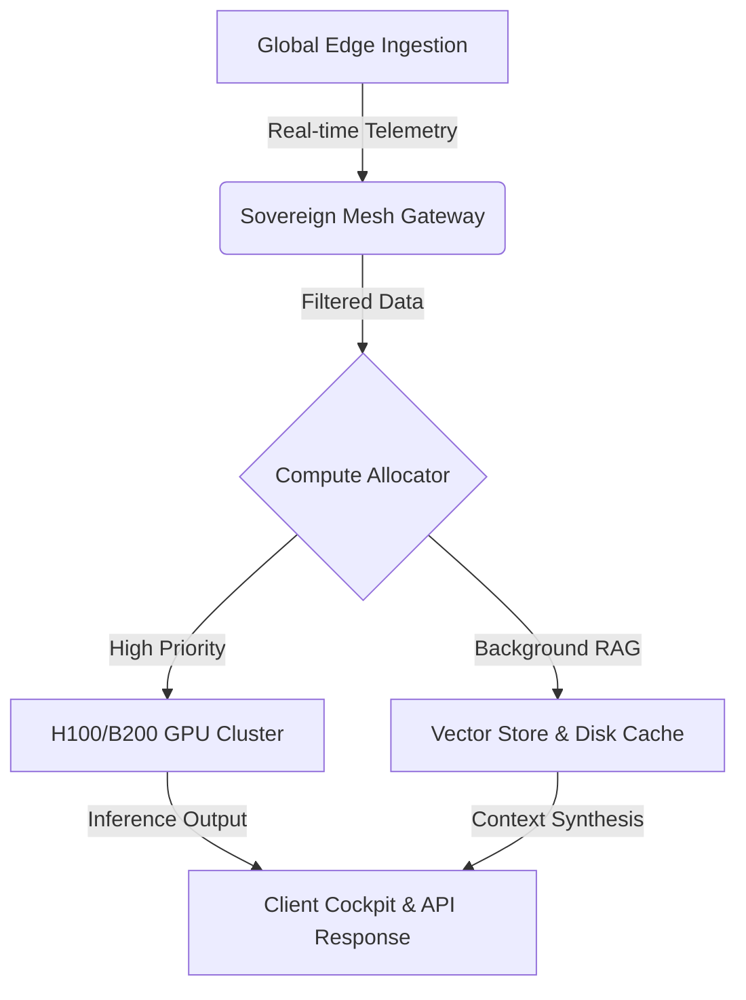

# 2026 Macro Outlook: Sovereign AI, Compute Math & Capital Allocation

The global macroeconomic landscape has entered a pivotal transition phase. What began as a raw compute land-grab has transformed into a complex geopolitical race involving **sovereign compute clusters**, **next-generation grid capacity**, and **dynamic capital repricing**.

---

## 1. Mathematical Energy Model & Formula

Over the past three years, software scalability was largely a function of algorithmic optimization and model parameters. As Einstein demonstrated mass-energy equivalence with $E = mc^2$, sovereign compute centers operate on baseline energy conversion.

> [!NOTE]
> The true moat of modern artificial intelligence is no longer token generation speed, but reliable baseload power interconnects and geothermal/nuclear colocation.

### The Sovereign Compute Yield Equation

We define the Net Economic Yield of a Sovereign AI Node $Y_{node}$ using KaTeX math notation:

$$Y_{node} = \sum_{t=1}^{T} \frac{\alpha \cdot \text{FLOPs}_t - \beta \cdot P_{\text{grid}}(t) - \gamma \cdot C_{\text{cool}}}{(1 + r)^t}$$

Where:
- $\text{FLOPs}_t$ represents effective matrix multiplication throughput at time $t$
- $P_{\text{grid}}(t)$ is the spot electricity price per Megawatt-hour (MWh)
- $\alpha, \beta, \gamma$ are localized efficiency scaling constants
- $r$ represents the sovereign discount rate

---

## 2. Infrastructure Architecture & Embedded Body Image

Sovereign compute nodes operate on multi-region edge mesh routing. Below is the primary data center infrastructure colocation setup:


### Mesh Topology Diagram



---

## 3. Short Python Snippet: Hello World & Telemetry

Below is a short Python program snippet initializing the telemetry engine:

```python
# Short Python Hello World & Compute Telemetry Snippet
def main():
    print("Hello World! Welcome to Rohit Curiosity Intelligence Engine.")

if __name__ == "__main__":
    main()
```

### Advanced Quantitative Risk Simulation

For broader risk modeling across 10,000 Monte Carlo scenarios:

```python
import numpy as np

def calculate_energy_var(num_simulations=10000, baseline_cost_mwh=45.0, volatility=0.28):
    """Calculates 99% Value at Risk (VaR) for GPU data center energy consumption."""
    np.random.seed(42)
    daily_returns = np.random.normal(0.001, volatility / np.sqrt(252), (num_simulations, 252))
    price_paths = baseline_cost_mwh * np.exp(np.cumsum(daily_returns, axis=1))
    
    max_costs = np.max(price_paths, axis=1)
    var_99 = np.percentile(max_costs, 99)
    
    return {
        "mean_mwh_cost": np.mean(max_costs),
        "var_99_mwh_cost": var_99
    }

metrics = calculate_energy_var()
print(f"99% VaR Peak MWh Cost: ${metrics['var_99_mwh_cost']:.2f}")
```

### SQL Liquidity Query

```sql
SELECT 
    country_code,
    SUM(capital_invested_usd) AS total_investment_millions,
    COUNT(DISTINCT data_center_id) AS active_nodes
FROM sovereign_ai_deployments
WHERE deployment_year = 2026
GROUP BY country_code
ORDER BY total_investment_millions DESC;
```

---

## 4. Summary & Strategic Outlook

1. **Energy Interconnect Moats**: Software wrappers without direct power capacity rights face margin compression.
2. **Local Model Sovereignty**: National mandates require on-premise data localization and LLM hosting.
3. **Capital Repricing**: Vertically integrated compute providers secure higher valuation multiples.
