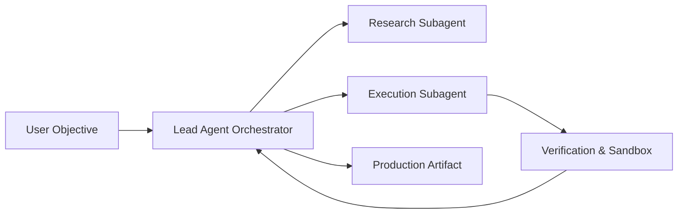

# The Architecture of Autonomous Systems: Beyond Chatbots

The conversation around AI has progressed beyond conversational generation. The actual challenge — and immense market opportunity — lies in **stateful action execution**.

When an agent is empowered to read file systems, propose code diffs, verify outcomes, and deploy applications without human friction, the paradigm of software development fundamentally transforms.

---

## Core Pillars of High-Reliability Agentic Systems

Building production-grade autonomous systems requires solving for non-determinism:

1. **Structured Tool Schemas:** Strict JSON contract boundaries preventing hallucinated parameters.
2. **Context Compression & Active Memory:** Separating long-term persistent knowledge from working memory to prevent degradation during long-horizon tasks.
3. **Multi-Agent Orchestration:** Decomposing complex goals into specialized subagents (researchers, builders, testers) with peer verification.

---

## The Economics of Agentic Workflows

When compute cost per cognitive task is 100x lower than manual human operations, work moves from batch cycles to continuous streaming improvements:

- Continuous security auditing on every commit.
- Real-time competitive market intelligence scanning.
- Self-healing software pipelines.

> "The winners in this era are not those who prompt the best, but those who engineer the most resilient execution pipelines."
