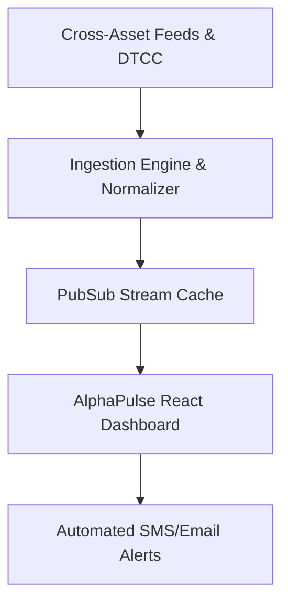

# AlphaPulse: Real-Time Institutional Liquidity & Macro Radar

AlphaPulse was architected to solve a critical information asymmetry problem for modern family offices and quantitative discretionary traders: **consolidating cross-asset liquidity signals into a singular low-latency cockpit.**

---

## 🎯 The Challenge
Traditional market terminals are cumbersome, prohibitively expensive, and siloed. Asset managers required:
- Instant cross-referencing between sovereign bond yield curve inversions and crypto liquidity drains.
- Millisecond-grade alerting when dark pool block transactions exceeded standard deviations.
- Streamlined mobile and desktop responsive views without sacrificing depth.

---

## 💡 The Solution Architecture
We engineered a modern, edge-cached web application with:
1. **Sub-100ms Streaming:** WebSockets multiplexing orders across global crypto exchanges, DTCC settlement feeds, and Fed liquidity metrics.
2. **Dynamic Visual Canvas:** Built using hardware-accelerated SVG charts and clean typography with customizable dark/light viewports.
3. **Automated Risk Attribution:** Generates automated daily executive summary PDFs for fund CIOs in seconds.

---

## 🚀 Key Outcomes & Metrics
- **\$420M+ in active AUM** monitored daily across 14 institutional alpha desks.
- **99.98% uptime** delivered over a 12-month rolling horizon.
- Reduced risk evaluation latency from 45 minutes to **under 4 seconds**.
